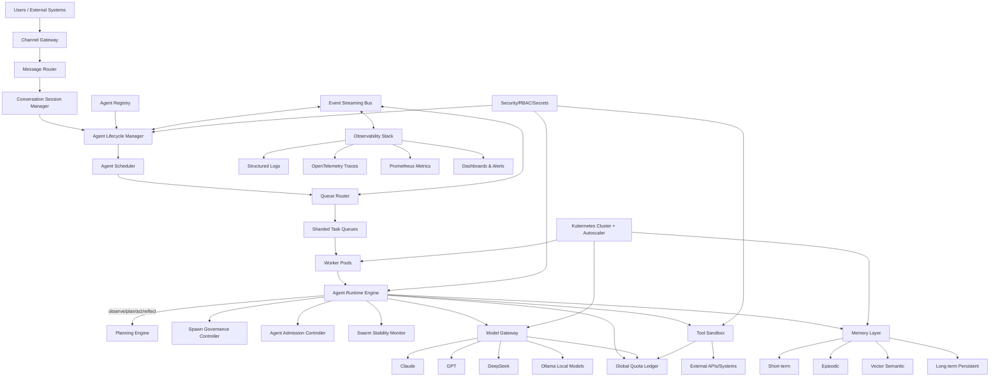

# AGENT_OPERATING_SYSTEM_ARCHITECTURE

## Executive Summary

This document defines a next-generation **Enterprise Agent Operating System (Agent-OS)** designed for **thousands of concurrently running autonomous agents** with strong reliability, governance, and scalability guarantees. The architecture is event-driven, policy-governed, and cloud-native, with strict separation of concerns across runtime execution, orchestration, model access, channels, memory, and enterprise controls.

---

## SECTION 1 — Agent Platform Core

### 1.1 Core Components

1. **Agent Registry**
   - Stores canonical definitions of agents: identity, version, goals, policy set, tools, memory profile, model profile, tenant binding.
   - Backed by transactional datastore (e.g., PostgreSQL + read cache).
   - Supports immutable versioning and staged rollouts.

2. **Agent Lifecycle Manager**
   - Manages lifecycle states: `draft -> validated -> deployed -> running -> paused -> retired`.
   - Orchestrates activation/deactivation, health checks, restarts, and failover.
   - Emits lifecycle events to event bus for observability and audit.

3. **Agent Scheduler**
   - Schedules execution by trigger type: cron, event-driven, channel message, webhook, policy trigger.
   - Uses priority classes and tenant-level fair-share scheduling.
   - Supports preemption and deadline-aware dispatch.

4. **Agent Runtime Engine**
   - Executes each agent in isolated runtime sessions.
   - Handles plan execution, tool calls, memory access, state persistence.
   - Integrates with quota ledger and governance policies before action.

5. **Spawn Governance Controller**
   - Enforces spawn policies for child agents.
   - Applies admission rules, hierarchical constraints, and rate limits.
   - Blocks recursive storms and runaway fan-out.

### 1.2 Core Capabilities

- Create agents through API/UI/CLI.
- Deploy agents in seconds via prebuilt runtime templates.
- Run agents continuously with checkpoint/recovery.
- Operate thousands of concurrent agents via horizontally scalable worker pools.

---

## SECTION 2 — Agent Runtime and Planning Engine

### 2.1 Cognitive Loop

Every agent follows a durable control loop:

1. **Observe**: ingest context (events, channel input, tool signals, memory retrieval).
2. **Plan**: generate stepwise execution plan with confidence/risk metadata.
3. **Act**: execute actions through tool/model gateway under policy checks.
4. **Reflect**: evaluate outcomes, update memory, revise strategy, emit telemetry.

Loop state is checkpointed after each step for replay and crash recovery.

### 2.2 Runtime Features

- **Tool Invocation Framework** with policy-based authorization and cost pre-checks.
- **Long-term Memory Integration** with retrieval and consolidation pipelines.
- **Multi-agent Collaboration** via shared tasks, delegation contracts, and rendezvous channels.
- **Deterministic Replay Mode** for debugging and forensic audits.

### 2.3 Agent Hierarchy Model

- **Coordinator Agents**: decomposition, strategy, dependency management.
- **Worker Agents**: execute scoped task units with bounded autonomy.
- **Utility Agents**: specialized functions (summarization, retrieval, formatting, validation).
- **Hierarchical Trees**: parent-child lineage tracking with max-depth and max-children limits.

---

## SECTION 3 — Multi-Model Intelligence Gateway

### 3.1 Model Gateway Principles

- Agents never call model providers directly.
- All inference requests pass through **Model Gateway** for control, routing, and accounting.

### 3.2 Capabilities

1. **Model Routing by Complexity**
   - Lightweight tasks -> smaller/cheaper models.
   - Complex planning/reasoning -> premium models.
   - Configurable routing policies by tenant and workload class.

2. **Cost Optimization**
   - Token-aware request shaping.
   - Dynamic model downgrades within quality thresholds.
   - Prompt compression and response truncation guards.

3. **Fallback Models**
   - Provider outage/latency/error fallback trees.
   - Circuit breaker integration for unstable providers.

4. **Semantic Caching**
   - Embedding-based approximate cache keying.
   - High-hit-rate reuse for repetitive prompts.

5. **Batch Inference**
   - Request coalescing for throughput-heavy workloads.
   - Queue-aware batching windows with SLA controls.

### 3.3 Supported Providers

- Anthropic Claude
- OpenAI GPT
- DeepSeek
- Local/self-hosted models via Ollama

---

## SECTION 4 — Messaging and Channel Integration Layer

### 4.1 Channel Gateway Architecture

1. **Message Router**
   - Normalizes inbound/outbound messages into canonical event schema.
   - Routes to correct agent session and policy pipeline.

2. **Channel Adapters**
   - Telegram, Slack, Discord, WhatsApp, Web Chat, API Webhooks.
   - Adapter-specific auth, rate limiting, retries, and webhook verification.

3. **Conversation Session Manager**
   - Maintains per-user/session context and continuity.
   - Session affinity for active agent threads.
   - TTL and idle timeout management.

### 4.2 Data Contracts

- Unified message envelope includes `tenant_id`, `channel_id`, `session_id`, `agent_id`, `trace_id`.
- Idempotency keys prevent duplicate event processing.

---

## SECTION 5 — Distributed Task and Event System

### 5.1 Backbone Components

- **Durable Event Streaming**: Kafka (primary) or Redis Streams/NATS for specific deployments.
- **Sharded Task Queues**: partitioned by tenant + priority + workload type.
- **Worker Pools**: specialized pools for planning, tools, memory indexing, channel dispatch.
- **Queue Router**: selects shard and pool based on policy and real-time load.
- **Backpressure Controller**: throttles producers, delays noncritical tasks, drops low-priority noise.

### 5.2 Reliability Requirements

- Thousands of tasks/sec sustained throughput.
- At-least-once delivery with idempotent handlers.
- Task replay from checkpoints and dead-letter queues.
- Poison-message quarantine and forensic replay pipeline.

---

## SECTION 6 — Massive Multi-Agent Orchestration

### 6.1 Stability Controls

1. **Agent Admission Controller**
   - Validates new agent starts against tenant quotas, cluster capacity, and policy.

2. **Spawn Rate Governor**
   - Token-bucket limits for child creation at tenant/agent/workflow levels.

3. **Swarm Stability Monitor**
   - Detects anomalous fan-out, recursion depth spikes, and non-terminating plans.

### 6.2 Anti-Collapse Detection

System detects and mitigates:
- **Spawn storms** -> immediate spawn freeze + alert.
- **Planning loops** -> loop breaker with forced reflection checkpoint.
- **Runaway execution** -> budget exhaustion stop + human escalation hook.

---

## SECTION 7 — Cost and Token Governance

### 7.1 Global Quota Ledger

Centralized, low-latency ledger tracks and enforces:
- Per-tenant budget caps (daily/monthly/hard limits).
- Per-agent budgets and burst windows.
- Token limits by model class.
- Tool cost accounting (API calls, compute time, external SaaS spend).

### 7.2 Debit-First Execution

Before model/tool execution:
1. Estimate cost.
2. Reserve budget from ledger.
3. Execute request.
4. Settle actual cost and refund delta.

Hard-fail if reserve is denied; no bypass path.

---

## SECTION 8 — Memory Architecture

### 8.1 Multi-Layer Memory

1. **Short-Term Memory**
   - In-session context window and working notes.

2. **Episodic Memory**
   - Time-ordered interaction episodes with outcomes.

3. **Vector Semantic Memory**
   - Embedded knowledge for similarity retrieval.

4. **Long-Term Persistent Memory**
   - Durable facts, preferences, and learned constraints.

### 8.2 Memory Management Features

- Context compression/summarization pipelines.
- Memory TTL policies by data class.
- Per-tenant memory quotas and eviction strategies.
- Privacy tags and policy-aware retrieval filtering.

---

## SECTION 9 — Enterprise Observability

### 9.1 Telemetry Stack

- **Structured Logging** (JSON, schema validated).
- **Distributed Tracing** via OpenTelemetry.
- **Metrics** via Prometheus.
- **SLO/Alerting** via Alertmanager/PagerDuty integration.
- **Dashboards** via Grafana.

### 9.2 Required Event Metadata

Every event/log/span includes:
- `trace_id`
- `agent_id`
- `tenant_id`
- `task_id`

### 9.3 Operational Views

- Agent success/failure and runtime latency.
- Queue lag and throughput by shard.
- Model usage/cost per tenant.
- Tool failure heatmaps.

---

## SECTION 10 — Security and Isolation

### 10.1 Security Capabilities

- **Tenant Isolation**: namespace and data-plane isolation.
- **RBAC Authorization**: fine-grained permissions for admin/operator/developer roles.
- **Secure Tool Sandbox**: tool execution in containers/microVMs.
- **Resource Limits**: CPU/memory/network/file quotas per execution.
- **Secret Management**: KMS-backed secret storage and scoped ephemeral credentials.

### 10.2 Runtime Hardening

- Signed agent packages and policy bundles.
- Egress policy controls for tool/network access.
- Tamper-evident audit logs.

---

## SECTION 11 — Autoscaling and Cluster Management

### 11.1 Scaling Components

- **Worker Autoscaler** based on queue depth and processing latency.
- **Queue-Depth Triggers** for rapid horizontal scale-out.
- **Latency-Based Scaling** to preserve SLO under burst loads.

### 11.2 Kubernetes Deployment Pattern

- Separate node pools for runtime workers, model gateway, and memory services.
- HPA + KEDA event-based autoscaling.
- Pod disruption budgets and anti-affinity for resilience.

---

## SECTION 12 — Agent Deployment Platform

### 12.1 Fast Deployment UX

Users can:
1. Create agent profile.
2. Configure tools and permissions.
3. Connect channels.
4. Deploy instantly.

### 12.2 Deployment Pipeline

- Preflight validation (policy, quota, schema).
- Artifact packaging and version tagging.
- Runtime warm start from template images.
- Activation in seconds with progressive health checks.

---

## SECTION 13 — Large-Scale Stability Testing

### 13.1 Test Harness Design

Synthetic load framework simulates:
- 100 agents
- 1,000 agents
- 10,000 agents

Scenarios include steady-state traffic, burst traffic, spawn storm attempts, and provider outages.

### 13.2 Measured KPIs

- End-to-end latency (p50/p95/p99)
- Queue depth and queue lag
- Worker utilization
- Token consumption and budget burn rate
- Spawn rejection ratio and loop abort rate

### 13.3 Exit Criteria

- No uncontrolled spawn cascades.
- SLOs maintained under 10k agent simulation with graceful degradation.
- Cost guardrails enforce hard budget ceilings.

---

## SECTION 14 — Architecture Diagram

---

## SECTION 15 — Engineering Roadmap

### Phase 1 — Core Runtime (Weeks 0–8)
- Build Agent Registry, Lifecycle Manager, Runtime Engine MVP.
- Implement observe-plan-act-reflect loop with checkpointing.
- Add basic scheduler and single-provider model gateway.
- Deliver initial observability baseline.

### Phase 2 — Distributed Scaling (Weeks 9–16)
- Introduce durable event bus and sharded queues.
- Deploy worker pool specialization and autoscaling.
- Add admission control, spawn governor, swarm monitor.
- Validate 1k concurrent agent stability.

### Phase 3 — Cost Governance (Weeks 17–22)
- Launch global quota ledger and debit-first execution.
- Integrate model/tool cost accounting.
- Add budget alerting and hard-stop enforcement.

### Phase 4 — Multi-Channel Integrations (Weeks 23–30)
- Ship Channel Gateway with Slack/Telegram/Discord/Webhooks.
- Add session manager and message normalization.
- Expand model gateway with multi-provider routing/fallback.

### Phase 5 — Enterprise Hardening (Weeks 31–40)
- Implement full RBAC, tenant isolation, and secure sandboxes.
- Add DR strategy, regional failover, compliance logging.
- Run 10k-agent stress campaigns and SLO certification.

---

## FINAL STEP — Enterprise Readiness Evaluation

### Compliance Against Objectives

- **Massive agent orchestration**: achieved via scheduler + sharded queues + admission/spawn controls.
- **Multi-model intelligence**: achieved through centralized model gateway with routing/fallback/caching.
- **Multi-channel integrations**: achieved with channel adapters + session manager + normalized routing.
- **Autonomous planning**: achieved via durable observe-plan-act-reflect engine with hierarchy support.
- **Cost governance**: achieved by global quota ledger and debit-first model/tool execution.
- **Distributed scalability**: achieved through event streaming, worker pools, autoscaling, and Kubernetes deployment.
- **Enterprise security/observability**: achieved via RBAC, tenant isolation, sandboxing, tracing, metrics, and alerts.

### Conclusion

The proposed design meets the criteria for an **ENTERPRISE AGENT OPERATING SYSTEM** with robust foundations for reliability, governance, and large-scale autonomous operation.
