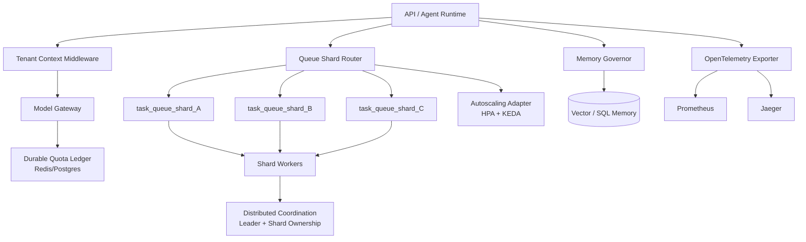

# Enterprise Agent Operating System Architecture

## Queue sharding design
- `core/queue_router.py` assigns tenants to deterministic shards with explicit overrides.
- Supports dynamic rebalance when shard topology changes.
- Workers subscribe to shard-specific queues and retain tenant isolation via metadata and tenant context checks.

## Quota ledger design
- `core/quota_ledger.py` provides atomic debits and durable usage persistence with Redis or Postgres stores.
- Enforces per-tenant and per-agent token quotas plus daily/monthly cost ceilings.
- `core/model_gateway.py` debits quota before any model invocation.

## Observability pipeline
- `monitoring/otel_exporter.py` emits metrics/traces with trace correlation.
- `monitoring/structured_logging.py` enriches logs with `trace_id`, `tenant_id`, `agent_id`, `request_id`, `task_id`.
- Queue and tool operations are traced for end-to-end diagnostics.

## Autoscaling topology
- `core/autoscaling_adapter.py` computes desired replicas for Kubernetes HPA and KEDA.
- Scaling signals: queue depth, worker utilization, p95 latency.
- Queue sharding + worker affinity in `core/task_partitioning.py` reduces contention hot spots.
