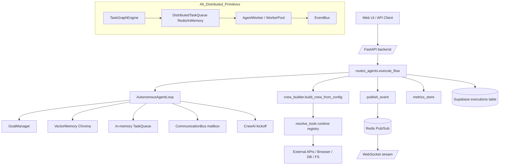
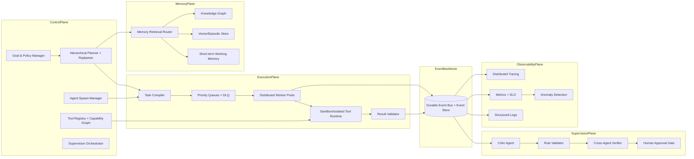

# Enterprise Autonomous Agent OS Audit

## Executive verdict

The repository already contains a **strong foundation** for an autonomous multi-agent platform: autonomy loop, queue-backed workers, event streaming, tool registry, vector memory, and basic guardrails are present. However, it is currently at an **early-scale stage** (roughly prototype-to-beta) rather than state-of-the-art enterprise autonomy.

To surpass industry standards, the architecture needs: (1) true distributed control plane and data plane separation, (2) durable event sourcing + replay, (3) policy-driven supervision and tool governance, (4) multi-tier memory, (5) robust reliability patterns (DLQ, retries with idempotency, circuit breakers), and (6) full observability with traces and anomaly detection.

---

## 1) Architecture audit (current state)

### 1.1 Main components discovered

- **Orchestration layer**
  - `backend/api/routes_agents.py` orchestrates execution lifecycle, cancellation, persistence updates, and autonomy loop invocation.
  - `backend/orchestrator/crew_builder.py` builds CrewAI graph from flow config with ordered tasks and retries.
  - `backend/autonomy/agent_loop.py` drives iterative plan→execute→evaluate cycles with loop guardrails.

- **Worker/execution layer**
  - In `core/` + `workers/`, there is a distributed queue abstraction and long-running worker pool (`core/task_queue.py`, `workers/agent_worker.py`).
  - In `backend/`, runtime execution is primarily CrewAI task execution inside API-triggered sessions.

- **Agents**
  - Agent templates/specs in `backend/agents/*.py` (supervisor + domain agents).
  - Delegation allowed for supervisor nodes in crew builder.

- **Task execution + graphing**
  - In-memory queue for backend loop (`backend/orchestrator/task_queue.py`).
  - Dependency-aware task graph engine + queue scheduling in `tasks/task_graph_engine.py`.

- **Tool integrations**
  - Runtime tool resolver and registry in `backend/tools/runtime_tools.py`.
  - Tool categories include search, browser, finance, travel, filesystem, API, and database.

- **Memory**
  - Chroma persistent vector memory in `backend/memory/vector_memory.py`.
  - Additional SQLite/vector memory module exists in top-level `memory/`.

- **Schedulers**
  - APScheduler-backed periodic execution in `backend/scheduler/agent_scheduler.py`.
  - Additional scheduler modules in top-level `scheduler/`.

- **Communication buses**
  - Backend in-process mailbox bus: `backend/agents/communication_bus.py`.
  - Redis Pub/Sub event stream: `backend/orchestrator/event_stream.py`.
  - Top-level event/message bus abstractions in `communication/`.

### 1.2 Runtime diagram (as-is)

---

## 2) Autonomy evaluation

### Capability assessment

- **Continuous execution loops**: **Yes (partial production readiness)**
  - `AutonomousAgentLoop.run()` iterates until completion/limits.
  - `AutonomyManager.run_loop()` also exists in core stack.

- **Self-reflection**: **Basic only**
  - Goal progress evaluation and memory event writes exist.
  - No dedicated critic/reflection model generating corrective strategies.

- **Dynamic task creation**: **Yes**
  - Spawn tasks supported in loop/task graph via payload-driven `spawn_tasks`.

- **Agent spawning**: **Limited**
  - Task spawning is present; dynamic runtime creation of new agent personas/capabilities is not robustly implemented.

- **Long-horizon planning**: **Weak-to-moderate**
  - Iterative loop exists, but no hierarchical planner, plan repair, or explicit long-horizon decomposition memory.

**Verdict**: Autonomy primitives exist, but advanced autonomy intelligence (reflection + adaptive strategic replanning) is missing.

---

## 3) Scalability evaluation

### Current support

- **Distributed workers**: **Partially present**
  - `core/task_queue.py` + `workers/agent_worker.py` provide Redis-backed distributed queue semantics.

- **Task queues**: **Yes**
  - In-memory queue in backend, plus Redis queue abstraction in core.

- **Parallel execution**: **Partial**
  - ThreadPool parallelization exists in `tasks/task_graph.py`.
  - Crew process is currently sequential in backend (`Process.sequential`).

- **Load balancing**: **Minimal/implicit**
  - Queue pull model gives basic balancing; no adaptive balancing, worker affinity, or autoscaling policies.

- **Fault tolerance**: **Partial**
  - Retry logic exists at task level in crew builder.
  - Missing DLQ, replay, idempotency keys, and robust recovery orchestration.

**Verdict**: Good foundation, not yet enterprise-grade distributed operations.

---

## 4) Data acquisition systems

### Present

- **Fetcher**: yes (`httpx`, urllib, API calls).
- **Parser**: yes (JSON parsing, page text extraction).
- **Browser automation**: yes (`playwright` in `browser_tools.py`).

### Missing/limited

- **Crawler framework**: no dedicated crawl frontier, URL dedupe, robots policy module, or crawl scheduler.
- **Distributed scraping workers**: no dedicated scrape queue/worker fleet.
- **Structured extraction pipelines**: no schema-driven extraction validation layer.

**Verdict**: Strong fetch/browser primitives, but no true web-scale acquisition subsystem.

---

## 5) Supervision layers

### Present

- Supervisor agent archetype exists (`supervisor_agent.py`).
- Basic orchestration and cancellation supervision in routes.

### Missing

- Dedicated **review agents** with mandatory approval gates.
- **Rule validators/policy engine** enforcing safety/compliance pre/post tool execution.
- **Cross-agent verification** (N-version outputs, adversarial reviewer, consensus).

**Verdict**: Supervision is conceptual, not yet an enforceable multi-layer control system.

---

## 6) Guardrails

### Present

- Iteration/runtime/cost limits in `LoopGuardrails`.
- Cancellation mechanism and terminal state enforcement in routes.
- Sandbox runtime exists in top-level tools (`tools/sandbox_runtime.py`) with CPU/memory/time limits.

### Missing

- Fine-grained tool permission model (per agent, per tenant, per task risk tier).
- Output policy validation (PII/compliance/security checks).
- Budget envelopes across full runs (token/latency/tool-spend policy).
- Human-in-the-loop escalation tiers.

**Verdict**: Basic guardrails exist; policy-driven guardrails are not yet enterprise ready.

---

## 7) Observability

### Present

- Structured JSON logging (`log_structured`).
- In-memory metrics with p95/error rate snapshots (`metrics_store`).
- Operational SLO/alert docs in `backend/docs/observability`.

### Missing

- Distributed tracing (OpenTelemetry spans across API → orchestrator → tool calls).
- Durable metrics backend (Prometheus/OTLP) and retention.
- Automated anomaly detection and incident correlation.

**Verdict**: Good start, but lacks production-grade telemetry depth.

---

## 8) Agent communication model

- **Current mode**: mixed.
  - Direct mailbox messaging via in-process communication bus.
  - Event-stream style communication via Redis Pub/Sub for session events.
- **Enterprise recommendation**: standardize on a durable event bus (Kafka/NATS/Redis Streams) for inter-agent coordination and replayability.

---

## 9) Missing components to become world-class

1. **Control Plane**
   - Policy engine (OPA/Cedar)
   - Workflow compiler + plan repair service
   - Agent capability registry + versioning

2. **Data Plane**
   - Durable event log (event sourcing)
   - Multi-queue execution fabric (priority queues + DLQ)
   - Worker autoscaler and placement controller

3. **Memory Plane**
   - Tiered memory: short-term scratchpad, episodic memory, semantic memory, knowledge graph
   - Memory quality scoring + decay/compaction

4. **Safety & Governance Plane**
   - Tool authz broker (least privilege)
   - Output validators + red-team/critic agents
   - Compliance auditing and immutable run ledger

5. **Observability Plane**
   - OpenTelemetry traces/metrics/log correlation
   - Online anomaly detection and auto-remediation hooks

6. **Acquisition Plane**
   - Distributed crawler service
   - Parsing/extraction service with schema contracts
   - Freshness scheduling + provenance tracking

---

## 10) Next-generation upgrade architecture

### Core behavior of the target autonomy loop

1. Evaluate strategic goals + constraints.
2. Generate hierarchical plan (mission → epics → tasks).
3. Compile tasks with policy and cost envelopes.
4. Dispatch to distributed queues by capability/priority.
5. Execute in sandboxed workers with tool authz checks.
6. Run multi-layer supervision (critic + validator + verifier).
7. Commit accepted outputs and memory writes.
8. Replan from event stream signals and anomalies.

---

## 11) Concrete code upgrade plan (engineering roadmap)

### Phase 1 — Hardening foundations (2–4 weeks)

1. Unify orchestration paths (backend loop + core distributed queue) behind one runtime interface.
2. Replace in-memory task queue in backend with Redis Streams or equivalent durable queue.
3. Add idempotency keys and run/task state machine transitions.
4. Introduce DLQ + retry policy objects (transient vs permanent errors).
5. Add OpenTelemetry instrumentation around API, planner, queue, worker, and tool calls.

### Phase 2 — Enterprise autonomy core (4–8 weeks)

6. Implement hierarchical planner service (strategic/tactical/execution layers).
7. Add reflection/critic pass after each cycle with failure taxonomy.
8. Implement dynamic agent spawning manager (ephemeral specialist agents).
9. Build capability graph + policy-aware tool broker (allow/deny + quotas).
10. Add quality scoring and confidence thresholds for outputs.

### Phase 3 — Supervision and governance (4–6 weeks)

11. Add rule validator engine for safety/compliance/business constraints.
12. Add cross-agent verification mode (independent solver + reviewer + tie-breaker).
13. Implement HITL escalation rules (risk score, confidence drop, policy violations).
14. Persist full audit trail (event-sourced execution ledger).

### Phase 4 — Data acquisition and intelligence (4–6 weeks)

15. Build distributed crawler service (frontier queue, politeness, dedupe, retries).
16. Add parser/extractor workers with schema contracts and provenance stamps.
17. Integrate acquisition outputs into memory pipeline with freshness metadata.

### Phase 5 — Reliability and scale excellence (ongoing)

18. Add autoscaling signals from queue depth, SLA lag, and worker utilization.
19. Implement circuit breakers and bulkheads per integration.
20. Launch anomaly detection (latency spikes, tool error drift, hallucination indicators).
21. Establish SRE runbooks, chaos tests, and game days.

---

## Target maturity model

- **Current**: Level 2/5 (functional autonomy prototype with partial distributed primitives).
- **After Phases 1–2**: Level 3.5/5 (robust autonomous platform).
- **After Phases 3–5**: Level 5/5 (enterprise autonomous agent operating system).

---

## EXECUÇÃO DAS FASES RECOMENDADAS

### Phase 1 — Hardening foundations
- Aplicar baseline de confiabilidade (timeouts, retries, circuit breakers).
- Cobrir componentes críticos com testes de falha controlada.

### Phase 2 — Enterprise autonomy core
- Formalizar loop observe-plan-act-reflect com checkpoints.
- Integrar hierarquia de agentes (coordinator/worker/utility).

### Phase 3 — Supervision and governance
- Enforçar admission control e governança de spawn.
- Ativar controles de orçamento e cotas por tenant.

### Phase 4 — Data acquisition and intelligence
- Consolidar gateway de modelos com cache semântico.
- Instrumentar avaliação de qualidade/custo por rota de modelo.

### Phase 5 — Reliability and scale excellence
- Executar campanha de carga de 100/1.000/10.000 agentes.
- Rodar caos + soak test e fechar gaps de estabilidade.
