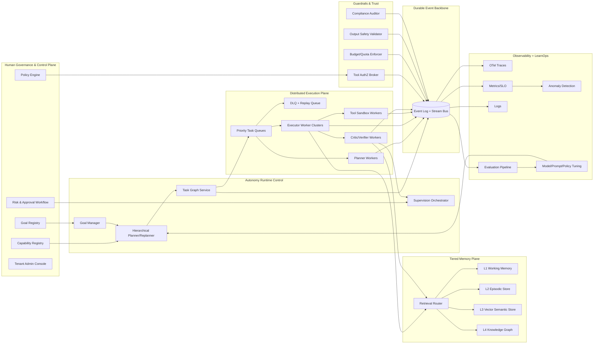
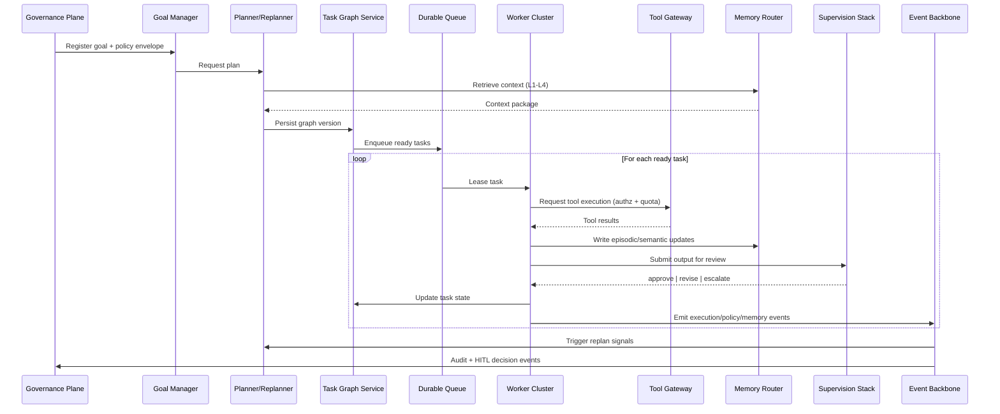

# Final Enterprise Autonomous Agent Operating System Architecture Synthesis

## 1) Merged Findings from Both Audits

Both audits converge on a common conclusion:

- The repository has a strong **Agent OS foundation**: orchestration APIs, queue abstractions, worker patterns, event streaming, tool integrations, vector memory primitives, scheduler components, guardrail basics, and early observability.
- The current platform is still **workflow-heavy** and **partially autonomous** rather than fully enterprise-autonomous.
- The architecture must evolve from a request/response multi-agent runtime into a **durable, policy-driven, continuously operating autonomous system**.

### Combined strengths (already present)

- Multi-agent orchestration with flow graph execution.
- Queue + worker primitives and scheduling modules.
- Event streaming and websocket updates.
- Tool ecosystem (browser, API, DB, domain adapters).
- Memory baseline (vector + persistence beginnings).
- Basic guardrails (timeouts, iteration limits, cancellation).
- Metrics/logging foundations.

### Combined gaps (must be closed)

- Durable event-sourced execution fabric with replay.
- Unified control plane and data plane separation.
- Persistent task graph and resilient queue semantics (priority, retries, DLQ, idempotency).
- Runtime tool binding with policy authorization and quotas.
- Supervision stack (critic/reviewer/verifier + HITL escalation).
- Tiered memory (working/episodic/semantic/knowledge graph).
- Distributed tracing and anomaly detection.
- Continuous autonomous goal loop with hierarchical planning + replanning.

---

## 2) System Inventory: Existing vs Redesign

## Existing and reusable systems

1. **API orchestration and run lifecycle management** (reuse, refactor).
2. **Worker + queue abstractions** (reuse core, replace in-memory paths in production).
3. **Tool adapters and service endpoints** (reuse through a new Tool Gateway contract).
4. **Vector memory components** (reuse as semantic layer substrate).
5. **Scheduler infrastructure** (reuse for periodic autonomy cycles).
6. **Execution history and audit persistence** (reuse and extend for immutable ledger).

## Systems requiring redesign or net-new implementation

1. **Durable Task Queue Fabric**
   - Replace mixed in-memory paths with durable queues + DLQ + idempotency.
2. **Persistent Task Graph Service**
   - Move from transient execution DAGs to durable graph state machine.
3. **Event Backbone**
   - Standardize on durable event log (Kafka/NATS/Redis Streams with retention+replay).
4. **Supervision Hierarchy**
   - Add mandatory critic/validator/verifier layers before commit.
5. **Governance Control Plane**
   - Add policy, risk scoring, approvals, audit trails.
6. **Guardrails Enforcement Engine**
   - Introduce pre/post tool and output policy enforcement with runtime deny/allow.
7. **Observability Stack**
   - Move to OpenTelemetry traces + centralized metrics + alerting.
8. **Learning Operations Pipeline**
   - Add offline evaluation, drift detection, prompt/policy/model improvement loops.

---

## 3) Final Runtime Architecture (Production Target)

### 3.1 Distributed worker clusters

- Capability-partitioned worker pools:
  - `planner-workers`
  - `executor-workers`
  - `tool-workers` (sandboxed)
  - `critic-workers`
  - `memory-workers`
- Horizontal autoscaling by queue depth, SLA lag, and CPU/token throughput.
- Worker leases + heartbeats + orphaned-task recovery.

### 3.2 Durable task queue

- Multi-queue model:
  - priority queues (`P0`, `P1`, `P2`)
  - capability queues (`web`, `data`, `code`, `ops`)
  - tenant-isolated shards for noisy-neighbor protection
- Retry policies per error class (transient/permanent).
- Dead-letter queues with automated triage and replay workflows.
- Idempotency keys on task submission + result commit.

### 3.3 Persistent task graph

- `task_graph` as durable state machine:
  - nodes: `pending -> ready -> running -> blocked -> review -> done|failed`
  - edges represent dependencies and gating constraints.
- Planner writes and replanner patches graph versions.
- Graph snapshots + event-sourced deltas for auditability.

### 3.4 Event backbone

- Durable event bus with append-only execution ledger:
  - `goal.events`, `task.events`, `agent.events`, `tool.events`, `policy.events`.
- All major components publish/subscribe.
- Full replay support for postmortem, training, and deterministic simulation.

### 3.5 Vector memory layers

- **L1 Working Memory**: low-latency session context (Redis).
- **L2 Episodic Memory**: task/run outcomes + rationales (Postgres).
- **L3 Semantic Memory**: vector store for retrieval (Chroma/pgvector).
- **L4 Knowledge Graph**: entity-relation graph for long-horizon reasoning.
- Retrieval router chooses memory path by intent, confidence, and latency budget.

### 3.6 Supervision hierarchy

1. **Execution agent** produces output.
2. **Critic agent** scores quality and failure taxonomy.
3. **Rule validator** checks policy/compliance/security constraints.
4. **Cross-agent verifier** performs independent confirmation for high-risk tasks.
5. **Human approval gate** required on policy/risk thresholds.

### 3.7 Human governance control plane

- Goal registration and risk classification.
- Policy authoring (RBAC/ABAC, budgets, tool scopes, data handling).
- Approval workflows and emergency kill-switch.
- Immutable audit and evidence package generation.

### 3.8 Guardrails enforcement

- Pre-execution checks:
  - tool permission, data access scope, budget, jurisdiction rules.
- In-flight controls:
  - timeout, token/tool spend ceilings, anomaly abort conditions.
- Post-execution controls:
  - output safety scanning, PII/secret leakage checks, compliance validation.

### 3.9 Observability stack

- OpenTelemetry traces across API → planner → queue → worker → tools → memory.
- Metrics: queue lag, throughput, success rate, cost/run, policy violations.
- Logs: structured and correlated with trace/span IDs.
- Alerting + anomaly detection + SLO burn-rate dashboards.

### 3.10 Learning operations pipeline

- Continuous dataset generation from execution ledger.
- Failure clustering + root-cause analytics.
- Prompt/policy/model experiments in shadow mode.
- Promotion pipeline with canary rollout and rollback safety.

---

## 4) Final System Architecture Diagram

---

## 5) Module-Level Architecture (Agents, Tasks, Workers, Tools, Memory)

---

## 6) Scaling Model (100s to 1000s of Concurrent Agents)

## Concurrency model

- **Unit of scale**: task execution slot, not agent object.
- Agents are lightweight logical actors; workers execute tasks from queues.
- Use sharded queues by tenant + capability + priority.

## Throughput strategy

- Partition event streams by `tenant_id + goal_id`.
- Co-locate memory retrieval caches with worker pools.
- Separate CPU-bound, IO-bound, and tool-bound workloads into distinct autoscaling groups.

## Reliability model

- At-least-once queue delivery + idempotent task commit.
- Retry budgets + exponential backoff + circuit breakers.
- DLQ replay tooling with supervised reinjection.

## Latency/SLO model

- SLO tiers:
  - Tier A: real-time interactive (<2-5s subtask acknowledgement)
  - Tier B: near-real-time operations (<30s task completion)
  - Tier C: batch cognition (minutes-hours)
- Priority preemption for Tier A queues.

## Capacity controls

- Global and tenant budgets (tokens, tool spend, runtime).
- Adaptive concurrency limits based on error rates and downstream pressure.
- Safe degradation modes (disable noncritical critics, defer low-priority goals).

---

## 7) Prioritized Implementation Roadmap

## Phase 0 (Immediate, 2 weeks): Stabilize Core Runtime

1. Unify runtime path behind one execution interface.
2. Replace in-memory queue usage with durable queue in all production paths.
3. Add idempotency keys and strict task/run state machine transitions.
4. Instrument OpenTelemetry end-to-end.

## Phase 1 (4-6 weeks): Autonomous Core

5. Implement Goal Manager + hierarchical Planner/Replanner.
6. Implement persistent Task Graph Service.
7. Introduce supervision pipeline (critic + rule validator).
8. Wire runtime tool binding through Tool Gateway with policy checks.

## Phase 2 (4-6 weeks): Governance and Guardrails

9. Launch policy engine, risk scoring, and HITL workflows.
10. Add immutable audit ledger and evidence export.
11. Enforce budget/quotas and compliance output validation.

## Phase 3 (4-8 weeks): Scale and LearnOps

12. Deploy capability-based worker clusters + autoscaler.
13. Add DLQ replay ops, chaos tests, and resiliency game days.
14. Roll out anomaly detection and automated remediation hooks.
15. Stand up LearnOps pipeline for continuous quality improvement.

## Phase 4 (Ongoing): Enterprise Optimization

16. Add knowledge graph memory and advanced retrieval routing.
17. Introduce cross-agent consensus modes for high-criticality tasks.
18. Expand governance analytics and policy simulation tooling.

---

## Final Classification

# ENTERPRISE AUTONOMOUS AGENT OPERATING SYSTEM

This target architecture is classified as an **ENTERPRISE AUTONOMOUS AGENT OPERATING SYSTEM** because it combines durable autonomous planning/execution loops, distributed worker fabrics, policy-governed tooling, multi-layer supervision, tiered memory, and enterprise-grade observability/governance into one coherent operating model.
