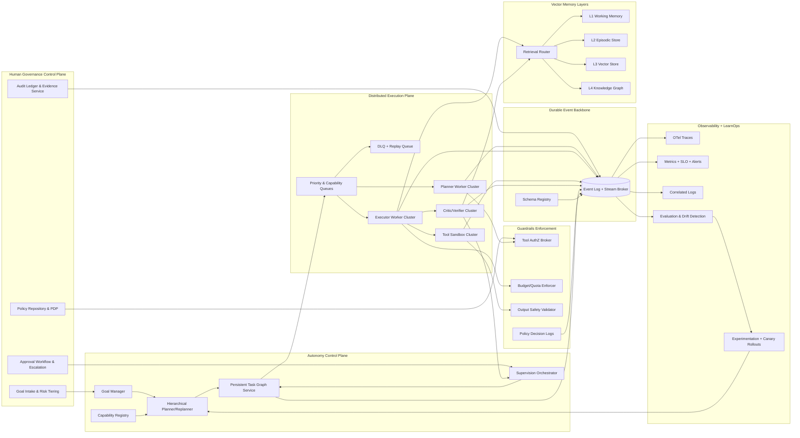
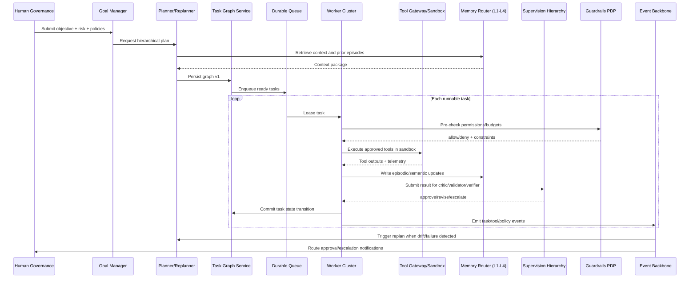

# Final Enterprise Autonomous Agent Operating System Architecture Synthesis

## 1) Merged Findings from Both Audits

Both audits align on the same headline: the repository has a capable autonomy foundation, but several enterprise-critical planes are still partial or absent.

### Consolidated status from both audits

| Domain | Merged conclusion | Combined evidence trend |
|---|---|---|
| Autonomy loop | **Strong / mostly complete** | End-to-end loop logic exists, including plan/execute/evaluate cycles and stop conditions. |
| Task queue + workers | **Partially complete** | Queue abstractions and workers exist, but durable semantics and fleet control are incomplete. |
| Task graph | **Partially complete** | Dependency scheduling exists, but persistence/replay/versioned resumability need redesign. |
| Eventing + messaging | **Partially complete** | In-process and Redis pub-sub patterns exist, but durable replayable backbone is missing. |
| Memory | **Partially complete** | Vector memory exists; tiered memory with lifecycle/governance is missing. |
| Guardrails + policy | **Partially complete** | Basic limits and policy checks exist; policy-as-code lifecycle + explainability are missing. |
| Supervision | **Insufficient** | Single-supervisor patterns exist; multi-layer critic/validator/verifier chain is not implemented. |
| Human governance | **Partially complete** | HITL primitives exist; enterprise approvals, signatures, escalation SLAs need redesign. |
| Observability | **Partially complete** | Structured logs/metrics exist; full tracing + durable telemetry backend absent. |
| Learning ops | **Partially complete** | Experience + feedback components exist; closed-loop experimentation and rollout governance missing. |

### Synthesis verdict

Current system maturity is best characterized as **advanced prototype / early production**. The final target architecture must unify existing modules into a single operating model with durable state, deterministic recovery, policy-governed execution, and scalable multi-cluster concurrency.

---

## 2) Existing Systems vs Redesign Requirements

## 2.1 Existing systems to preserve and harden

1. **Autonomy runtime core**
   - Preserve loop/orchestration semantics and runtime control APIs.
2. **Queue/worker primitives**
   - Preserve interfaces and execution contracts; replace transient internals.
3. **Task graph decomposition logic**
   - Preserve dependency semantics and dynamic task spawning behavior.
4. **Tool ecosystem**
   - Preserve tool adapters and registry shape; enforce contracts and policy.
5. **Memory adapters**
   - Preserve vector integrations; elevate into tiered memory architecture.
6. **Basic governance and validation hooks**
   - Preserve gating interfaces for policy and HITL.
7. **Logging/metrics foundations**
   - Preserve instrumentation points; route to enterprise observability backend.

## 2.2 Systems requiring redesign or net-new implementation

1. **Durable task queue fabric**
   - Priority queues, retry classes, DLQ, visibility timeout recovery, idempotency keys.
2. **Persistent task graph service**
   - Event-sourced graph state transitions, checkpoint/resume, deterministic replay.
3. **Durable event backbone**
   - Broker with consumer groups, retention policy, schema contracts, replay.
4. **Supervision hierarchy**
   - Task/domain/executive supervision lanes with critic + verifier + escalation.
5. **Governance control plane**
   - Policy repository, approvals UX/API, identity signatures, immutable audit ledger.
6. **Guardrails enforcement plane**
   - Runtime policy decision point, explainable decisions, central violation registry.
7. **Observability platform**
   - Distributed tracing + long-term metrics/log storage + incident integrations.
8. **Learning operations pipeline**
   - Evaluation corpus, drift detection, experiment tracking, canary/rollback automation.

---

## 3) Final Runtime Architecture (Production)

### 3.1 Distributed worker clusters

- **Cluster roles**
  - `planner-cluster`: plan generation and replanning.
  - `executor-cluster`: primary task execution.
  - `tool-sandbox-cluster`: isolated external tool invocation.
  - `critic-verifier-cluster`: quality/safety verification.
  - `memory-maintenance-cluster`: compaction, indexing, lifecycle jobs.
- **Control mechanisms**
  - Heartbeats + leases, stale lease recovery, autoscaling by queue lag and SLO burn.

### 3.2 Durable task queue

- Queue topology:
  - Priority lanes (`urgent`, `interactive`, `standard`, `batch`).
  - Capability lanes (`web`, `code`, `analysis`, `ops`, `integration`).
  - Tenant partitions for isolation.
- Delivery model:
  - At-least-once with idempotent commit.
  - Retry policies by failure type.
  - DLQ + replay pipeline with operator and policy checkpoints.

### 3.3 Persistent task graph

- Graph is a durable state machine:
  - `pending -> ready -> leased -> running -> review -> committed|failed|blocked`.
- Every mutation is evented and versioned.
- Supports graph patching by replanner and supervisor overrides.

### 3.4 Event backbone

- Central append-only event stream with schema governance.
- Topics include: goal, task, worker, tool, policy, memory, supervision, learning.
- Enables replay for forensic audit, simulation, and model improvement.

### 3.5 Vector memory layers

- **L1 Working memory**: short-lived run context cache.
- **L2 Episodic memory**: run outcomes, decisions, rationales.
- **L3 Semantic memory**: vector retrieval corpus.
- **L4 Knowledge graph memory**: entities, relations, constraints.
- Retrieval router picks layers by latency budget, confidence, and risk profile.

### 3.6 Supervision hierarchy

1. **Task Supervisor**: checks execution-level quality/completeness.
2. **Domain Supervisor**: validates domain correctness and policy fit.
3. **Executive Supervisor**: resolves conflicts, risk elevation, strategic alignment.
4. **Human approver**: mandatory for high-risk/policy-triggered actions.

### 3.7 Human governance control plane

- Goal intake, policy assignment, and risk tiering.
- Approval workflows with identity-bound signatures.
- Escalation timers, delegation rules, and kill-switch controls.
- Immutable evidence bundle generation for audit/compliance.

### 3.8 Guardrails enforcement

- **Pre-execution**: policy + permissions + budget validation.
- **In-execution**: runtime spend/time thresholds, anomaly abort signals.
- **Post-execution**: output safety, compliance/PII checks, confidence thresholds.
- All decisions logged as explainable policy events.

### 3.9 Observability stack

- OpenTelemetry traces across all runtime hops.
- Durable metrics backend with SLO/error-budget dashboards.
- Central log correlation by trace/task/tenant IDs.
- Alert routing to on-call with runbook links and incident timelines.

### 3.10 Learning operations pipeline

- Event ledger -> feature extraction -> evaluation datasets.
- Regression + drift detection gates.
- Experiment orchestration for prompts/policies/planner variants.
- Canary promotion with automatic rollback triggers.

---

## 4) Final System Architecture Diagram

---

## 5) Module-Level Interaction Architecture

---

## 6) Scaling Model for 100s-1000s of Concurrent Agents

### 6.1 Core scaling principle

Scale **task execution slots**, not agent objects. Agents remain logical identities; stateless workers consume task leases from sharded durable queues.

### 6.2 Horizontal partitioning strategy

- Partition keys: `tenant_id`, `goal_id`, `capability`, `priority`.
- Queue shards mapped to worker autoscaling groups.
- Event topics partitioned identically for locality and replay efficiency.

### 6.3 Concurrency controls

- Per-tenant quotas (tokens, spend, runtime, tool calls).
- Adaptive concurrency limits driven by downstream latency/error pressure.
- Backpressure propagation from tools/memory to planner and queue admission.

### 6.4 Reliability and consistency model

- Delivery: at-least-once.
- Consistency: idempotent commit + optimistic graph versioning.
- Recovery: retries, DLQ, replay, checkpoint restore, stale lease reclamation.

### 6.5 Performance tiers

- **Tier A (interactive)**: immediate acknowledgement + strict queue priority.
- **Tier B (operational)**: bounded latency completion.
- **Tier C (batch cognition)**: throughput-optimized background processing.

### 6.6 Expected envelope

- Hundreds of concurrent goals: single region, multi-cluster workers with shard-aware routing.
- Thousands of concurrent goals: multi-region active/active control plane with region-local execution and federated governance/observability.

---

## 7) Final Prioritized Implementation Roadmap

## Priority 0 — Reliability Foundation (Weeks 1-4)

1. Standardize on one durable queue/event substrate.
2. Implement idempotency keys, retries, DLQ, replay APIs.
3. Persist task graph transitions and checkpoint/resume semantics.
4. Add worker leases/heartbeats and stale-task recovery.

## Priority 1 — Governance & Supervision Core (Weeks 5-8)

5. Deliver policy repository + policy decision point + explainable decisions.
6. Launch supervision hierarchy (task/domain/executive + escalation logic).
7. Implement full human approval plane (identity, signatures, SLAs, timeout actions).

## Priority 2 — Observability & Operations (Weeks 9-12)

8. Roll out OpenTelemetry tracing across API/planner/queue/worker/tool/memory.
9. Deploy durable metrics/log pipeline with SLO dashboards.
10. Integrate alert routing (PagerDuty/Slack) with runbooks and incident hooks.

## Priority 3 — Learning Ops Maturity (Weeks 13-16)

11. Build benchmark/evaluation pipeline with CI gating.
12. Add drift detection and automated regression analysis.
13. Enable experiment tracking and canary rollout/rollback for planner/policy/prompt changes.

## Priority 4 — Enterprise Hardening (Weeks 17+)

14. Add multi-tenant isolation controls across memory, queues, and tool permissions.
15. Introduce multi-region resilience, disaster recovery drills, and chaos exercises.
16. Implement advanced knowledge graph memory and consensus verification for high-criticality tasks.

---

## Final Classification

# ENTERPRISE AUTONOMOUS AGENT OPERATING SYSTEM

This final architecture is classified as an **ENTERPRISE AUTONOMOUS AGENT OPERATING SYSTEM** because it combines durable autonomous execution, distributed worker fabrics, persistent graph and event state, policy-governed tooling, hierarchical supervision, human governance, and closed-loop learning/operations at enterprise scale.

---

## IMPLEMENTAÇÃO DIRETA DO ROADMAP (AÇÃO IMEDIATA)

### Priority 0 — Reliability Foundation
- Congelar padrões de resiliência (retry/backoff/idempotência) no runtime.
- Garantir monitoramento de lag de fila e saturação de workers.

### Priority 1 — Governance & Supervision Core
- Ativar políticas de admissão, spawn limit e budget enforcement.
- Publicar trilha de decisão auditável para bloqueios e aprovações.

### Priority 2 — Observability & Operations
- Correlacionar métricas, logs e traces por `trace_id/agent_id/tenant_id/task_id`.
- Criar painéis de saúde operacional e alertas de risco de swarm.

### Priority 3 — Learning Ops Maturity
- Padronizar avaliação pós-execução e retenção de memória resumida.
- Fechar ciclo de melhoria com feedback supervisionado.

### Priority 4 — Enterprise Hardening
- Endurecer isolamento de execução de ferramentas e segredos.
- Validar readiness com testes de escala e recuperação regional.
