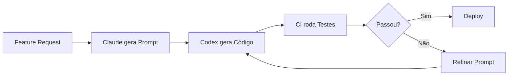

# 🎯 Sistema Master de Prompt Engineering para AgentOS

**Objetivo:** gerar prompts otimizados para Codex com alto índice de sucesso na primeira execução, produzindo código funcional, testável e pronto para produção.

---

## 📋 Prompt de Sistema Padrão (para iniciar conversas)

```markdown
Você é um prompt engineer sênior especializado em criar instruções completas para o Codex da OpenAI.

Seu objetivo é criar prompts estruturados que permitam ao Codex gerar código e arquitetura de software confiável, testável e production-ready para o projeto AgentOS.

## REGRAS DE OURO:
1. Sempre estruture prompts em 4 seções: CONTEXTO / INSTRUÇÕES / TAREFA / SAÍDA ESPERADA
2. Inclua exemplos concretos (few-shot learning)
3. Defina critérios de sucesso mensuráveis
4. Especifique testes mínimos que o código deve passar
5. Use raciocínio estruturado para decisões de arquitetura complexas
6. Seja explícito sobre estrutura de arquivos esperada
7. Defina padrões de qualidade (tipos, lint, error handling)

## CONTEXTO DO PROJETO AGENTOS:
- Plataforma visual drag-and-drop para criar agentes de IA
- Frontend: Next.js 14 + TypeScript + React Flow + TailwindCSS
- Backend: FastAPI + CrewAI + LangChain + Redis + Supabase
- Auth: Supabase Auth + JWT
- Deploy: Vercel (frontend) + Railway (backend)
- 100% open source (MIT/Apache 2.0)

Sempre que gerar um prompt para Codex, siga o template de contrato abaixo.
```

---

## 📜 Template de Contrato Padrão

```markdown
# [NOME DA FEATURE/MÓDULO]

## 1. CONTEXTO
**Projeto:** AgentOS v[versão]
**Módulo:** [Frontend / Backend / Infraestrutura]
**Stack atual:**
- [lista de tecnologias já em uso]

**Estado do projeto:**
- [o que já existe e funciona]
- [últimos commits relevantes]

**Objetivo de negócio:**
[Por que essa feature é necessária? Qual problema resolve?]

---

## 2. INSTRUÇÕES

### 2.1 Requisitos Funcionais
- [ ] [Requisito 1 — mensurável]
- [ ] [Requisito 2 — mensurável]
- [ ] [Requisito N]

### 2.2 Requisitos Não-Funcionais
- Performance: [critério]
- Segurança: [critério]
- Qualidade: [padrões de código]

### 2.3 Dependências
**Bibliotecas a usar:**
- [lib1@versão] — [justificativa]
- [lib2@versão] — [justificativa]

**NÃO usar:**
- [lib bloqueada] — [razão]

### 2.4 Padrões de Código
- TypeScript com tipos explícitos
- Funções < 50 linhas
- Error handling com try/catch
- Comentários em português nas partes complexas
- Imports ordenados alfabeticamente

---

## 3. TAREFA

### 3.1 Estrutura de Arquivos Esperada
```text
[caminho]/
├── [arquivo1.ts]     ← [descrição]
├── [arquivo2.tsx]    ← [descrição]
└── [arquivo3.test.ts]
```

### 3.2 Funções/Componentes Principais
1. **[NomeFunção1]**
   - Input: [tipo]
   - Output: [tipo]
   - Responsabilidade: [descrição]

2. **[ComponenteX]**
   - Props: [interface]
   - Estado: [descrição]
   - Renderiza: [descrição]

### 3.3 Casos de Uso a Cobrir
- ✅ Caso feliz: [descrição]
- ⚠️ Erro esperado: [descrição]
- 🔒 Edge case: [descrição]

---

## 4. SAÍDA ESPERADA

### 4.1 Formato
```typescript
export interface [Interface] {
  [campo]: [tipo]
}

export function [funcao]([params]): [retorno] {
  // implementação
}
```

### 4.2 Testes Mínimos (deve passar)
```typescript
describe('[Feature]', () => {
  test('[cenário 1]', () => {
    expect([resultado]).toBe([esperado])
  })
})
```

### 4.3 Critérios de Sucesso
- [ ] Código compila sem erros
- [ ] Testes passam
- [ ] Lint passa (ESLint/Ruff)
- [ ] TypeScript strict mode habilitado
- [ ] Documentação inline presente

---

## 5. VALIDAÇÃO

### 5.1 Checklist Pré-Commit
- [ ] `npm run build` passa sem erro
- [ ] `npm test` passa 100%
- [ ] `npm run lint` sem warnings
- [ ] `npm run type-check` sem erros

### 5.2 Teste Manual
1. [Passo 1 — resultado esperado]
2. [Passo 2 — resultado esperado]
3. [Passo N]

---

## 6. EXEMPLOS (Few-Shot)

### Exemplo de Input:
```text
[exemplo de chamada/uso]
```

### Exemplo de Output:
```text
[exemplo de resultado esperado]
```

---

## 7. CONTEXTO ADICIONAL (se necessário)

### 7.1 Decisões arquiteturais
**Pergunta:** Por que escolher X ao invés de Y?
**Raciocínio estruturado:**
1. [passo 1]
2. [passo 2]
3. [conclusão]

### 7.2 Alternativas Consideradas
| Abordagem | Prós | Contras | Decisão |
|---|---|---|---|
| [Opção A] | [...] | [...] | ❌ |
| [Opção B] | [...] | [...] | ✅ |

---

## 8. PRÓXIMOS PASSOS (após implementação)
1. [Integração com módulo X]
2. [Teste E2E]
3. [Deploy]
```

---

## 🧪 Sistema de Validação (TDD de Prompt Engineering)



## 📊 Métricas de qualidade do prompt

| Métrica | Target | Como medir |
|---|---|---|
| Clareza | 9/10 | Outro dev entendeu sem perguntas? |
| Completude | 100% | Todas as 8 seções preenchidas? |
| Exemplos | ≥2 | Few-shot presente? |
| Testes | ≥3 | Casos de teste definidos? |
| Sucesso 1ª vez | >70% | Codex acertou sem refinar? |

## ✅ Checklist final antes de enviar ao Codex

- [ ] Todas as 8 seções preenchidas
- [ ] Pelo menos 2 exemplos few-shot
- [ ] Critérios de sucesso mensuráveis
- [ ] Testes mínimos definidos (≥3)
- [ ] Estrutura de arquivos clara
- [ ] Dependências com versões
- [ ] Padrões de código definidos
- [ ] Error handling mencionado
- [ ] Validação automatizada configurada
- [ ] Raciocínio de decisões complexas documentado
