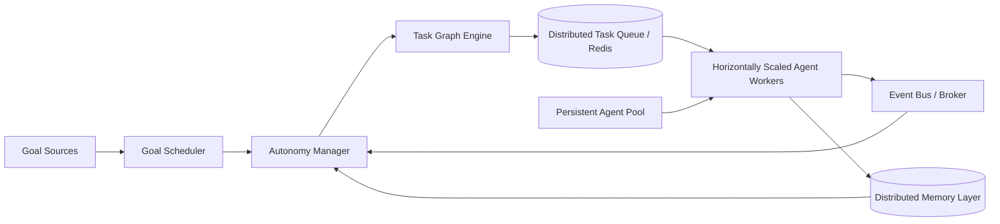

# Scalable Agent Platform Architecture

## System Classification

**DISTRIBUTED AUTONOMOUS AGENT OPERATING SYSTEM**

## High-level Distributed Architecture Diagram



## Agent Lifecycle

1. Agents are pre-registered in a **persistent AgentPool**.
2. Scheduler/AutonomyManager requests matching specialization.
3. Pool allocates lowest-load eligible agent.
4. Worker executes assigned task using agent capability.
5. Result and agent state are persisted in distributed memory.
6. Agent is released back to pool for reuse.

## Task Graph Execution

- Plans are transformed into graph nodes by `TaskGraphEngine`.
- Nodes can include dependency edges and numeric priority.
- Dependency-free tasks are immediately queueable.
- Completion events unlock downstream tasks for parallel scheduling.
- Workers may dynamically spawn tasks, which are attached to the graph at runtime.

## Worker System

- Workers are independent runtimes (`AgentWorker`) that:
  - Pull tasks from distributed queue.
  - Execute task payloads through pluggable handlers.
  - Persist execution results.
  - Publish completion/failure events to event bus.
- Horizontal scaling is achieved by adding more worker processes/containers consuming the same queue.

## Event Bus

- Event bus uses pub/sub semantics with:
  - `publish_event()` for topic-scoped messages.
  - `subscribe_event()` for worker/manager listeners.
  - `broadcast()` for system-wide fanout.
- Completion and failure events drive orchestration reactions and retries.

## Memory System

`DistributedMemory` combines:

1. **Relational persistence (SQLite/Postgres-compatible model)**
   - Task history
   - Agent state
   - Shared world model
2. **Semantic retrieval layer**
   - Vector embeddings per memory entry
   - Cosine similarity ranking for contextual recalls

## Autonomy Loop

The runtime executes a continuous control loop:

```python
while True:
    evaluate_goals()
    schedule_tasks()
    trigger_workers()
```

Implemented via `AutonomyManager` + `GoalScheduler` + distributed queue/workers.
