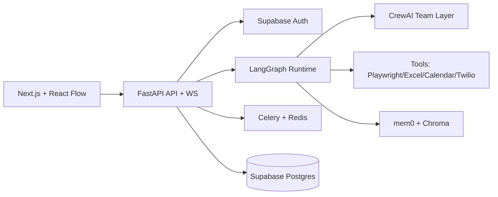

# AgentOS Foundation (visão consolidada)

## Resumo técnico
- Stack aderente ao mercado e com foco open source comercialmente permissivo.
- Recomendação: usar **LangGraph como runtime principal** e CrewAI como camada de papéis/equipes.
- Recomendação: manter Supabase como sistema transacional e adicionar Redis para filas/eventos.

## Diagrama de alto nível

## Backlog priorizado
### P0
1. Módulo 1: Canvas visual (sidebar + nós + conexões + painel de config + console).
2. Endpoint `/api/agents/run` com validação Pydantic.
3. Builder básico de fluxo para runtime LangGraph.
4. Streaming de logs por WebSocket.

### P1
1. FinancialAgent + Excel toolchain.
2. MeetingAgent + Calendar API.
3. Template de empresa (financeiro e marketing).

### P2
1. Playwright para TravelAgent.
2. PhoneAgent com Twilio + STT/TTS.
3. Marketplace de templates e versionamento.

## Esquema inicial de banco (resumo)
- `workspaces`, `users`, `workspace_members`
- `flows`, `flow_versions`, `runs`, `run_steps`
- `agent_profiles`, `agent_tools`
- `knowledge_bases`, `documents`, `document_chunks`
- `integrations`, `secrets`, `webhook_endpoints`

## Lista inicial de nós
- Controle: Start, End, If/Else, Loop, Delay, Error Handler.
- Agentes: Financial, Travel, Meeting, Phone, Excel, Marketing, Supervisor.
- Ferramentas: HTTP, Search, Calendar, Twilio Call, Excel Create, Vector Search.
- Governança: Human Approval, Policy Check, Cost Guard.
